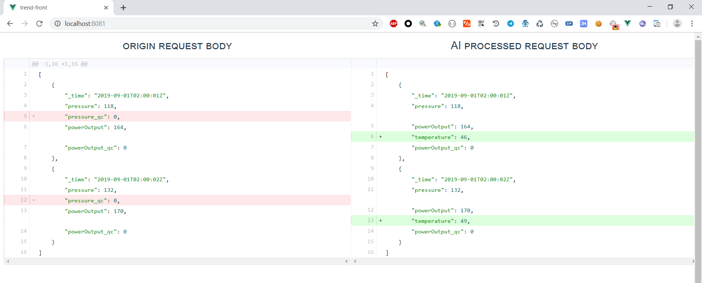

## Simple js project display diff strings side by side from backend server


### Start ui with

```
npm install

npm run serve
```

### configure backend

- Websocket message format
``` java
public class Message {

    //0: left panel, 1: right panel
    Integer msgType;
    String message;

    public Message(Integer msgType, String message) {
        this.msgType = msgType;
        this.message = message;
    }

}
```

- configure backend api address in `config.js`

## Demo
